# Body Scan Process Flowchart

This document provides a detailed flowchart of the complete body scanning process from image capture to final measurements and GLB file output.

## Executive Summary - Process Overview

**High-level overview suitable for panel presentations:**

```mermaid
flowchart TD
    Start([User Initiates Body Scan]) --> Input[User Inputs Height<br/>Calibration: 100-250cm]
    Input --> Mode{Scan Mode Selection}
    
    Mode -->|Quick Scan| Single[Single Image Mode]
    Mode -->|3D Reconstruction| Multi[Multi-View Mode<br/>3 Images]
    
    Single --> Capture[Image Capture<br/>CameraX]
    Multi --> Capture
    
    Capture --> Preprocess[Image Preprocessing<br/>OpenCV: CLAHE, Resize,<br/>Color Optimization]
    Preprocess --> PoseDetect[Pose Detection<br/>MediaPipe: 33 Landmarks]
    PoseDetect --> KeypointMap[Keypoint Mapping<br/>33 → 135 Keypoints<br/>Interpolation & Extrapolation]
    
    KeypointMap --> CheckMode{Scan Mode?}
    CheckMode -->|Single Image| Measurements[Calculate Measurements<br/>8 Anthropometric Values<br/>Shoulder, Arm, Leg, Hip, etc.]
    Measurements --> Validate[Validate Measurements<br/>Physiological Range Check]
    Validate --> Store[Store in Database<br/>Room Database]
    Store --> Export[Export Results<br/>JSON, CSV, PDF]
    Export --> EndSingle([Complete<br/>~1 second])
    
    CheckMode -->|Multi-View| CheckViews{All 3 Views<br/>Processed?}
    CheckViews -->|No| Capture
    CheckViews -->|Yes| Triangulate[3D Triangulation<br/>Multi-View Stereo<br/>135 3D Keypoints]
    Triangulate --> Mesh[Generate 3D Mesh<br/>Delaunay Triangulation<br/>BODY_25 Format]
    Mesh --> GLB[Export GLB File<br/>3D Model for Visualization]
    GLB --> Measurements3D[Calculate 3D Measurements<br/>Enhanced Accuracy]
    Measurements3D --> Validate3D[Validate 3D Measurements]
    Validate3D --> Store3D[Store in Database<br/>+ GLB File Path]
    Store3D --> Export3D[Export Results<br/>JSON, CSV, PDF + GLB]
    Export3D --> EndMulti([Complete<br/>~3 seconds])
    
    style Start fill:#e1f5ff,stroke:#0066cc,stroke-width:3px
    style EndSingle fill:#d4edda,stroke:#28a745,stroke-width:2px
    style EndMulti fill:#d4edda,stroke:#28a745,stroke-width:2px
    style Single fill:#fff3cd,stroke:#ffc107,stroke-width:2px
    style Multi fill:#fff3cd,stroke:#ffc107,stroke-width:2px
    style GLB fill:#f8d7da,stroke:#dc3545,stroke-width:2px
    style Store fill:#d1ecf1,stroke:#17a2b8,stroke-width:2px
    style Store3D fill:#d1ecf1,stroke:#17a2b8,stroke-width:2px
```

### Key Process Stages

1. **User Input & Mode Selection** (100ms)
   - User provides height calibration (100-250cm)
   - Selects scan mode: Single Image (quick) or Multi-View (3D)

2. **Image Capture** (200ms per image)
   - CameraX integration with real-time framing guides
   - RGB image capture with validation

3. **Image Preprocessing** (200ms per image)
   - OpenCV pipeline: CLAHE enhancement, resizing (~640px), color optimization
   - Optimizes images for MediaPipe pose detection

4. **Pose Detection** (500ms per image)
   - MediaPipe Tasks Vision API detects 33 anatomical landmarks
   - Extracts body structure: head, torso, limbs, hands, feet

5. **Keypoint Mapping** (50ms)
   - Expands 33 MediaPipe landmarks to 135 keypoints
   - Uses interpolation and anatomical extrapolation

6. **Measurement Calculation** (100ms)
   - Calculates 8 anthropometric measurements:
     - Shoulder Width, Arm Length, Leg Length, Hip Width
     - Upper/Lower Body Length, Neck Width, Thigh Width
   - Applies user height calibration for accurate scaling

7. **3D Reconstruction** (Multi-View Only, 300ms)
   - Multi-view stereo triangulation from 3 camera angles
   - Generates 135 3D keypoints with depth information

8. **3D Mesh Generation** (Multi-View Only, 500ms)
   - Converts to BODY_25 format (25 keypoints)
   - Delaunay triangulation creates 3D surface mesh
   - Exports GLB file for 3D visualization

9. **Data Storage & Export** (100ms)
   - Stores scan data in local Room database
   - Exports measurements in JSON, CSV, or PDF formats
   - Saves GLB file path (multi-view scans)

### Performance Summary

| Scan Type | Total Time | Output Files | Use Case |
|-----------|------------|--------------|----------|
| **Single Image** | < 1.5 seconds | Measurements (JSON/CSV/PDF)<br/>2D Keypoints (JSON) | Quick body measurements<br/>Fitness tracking |
| **Multi-View** | < 5 seconds | Measurements (JSON/CSV/PDF)<br/>3D Keypoints (JSON)<br/>GLB 3D Model | 3D body reconstruction<br/>Virtual avatars<br/>Precise measurements |

### Key Features

- ✅ **On-Device Processing**: All computation performed locally, no cloud dependency
- ✅ **Privacy-First**: Images deleted immediately after processing
- ✅ **Sub-Centimetre Accuracy**: Precise measurements validated against physiological ranges
- ✅ **Real-Time Performance**: Fast processing suitable for mobile devices
- ✅ **Memory Efficient**: < 100MB peak memory usage
- ✅ **Offline Capable**: Complete functionality without internet connection

---

## Detailed Process Overview

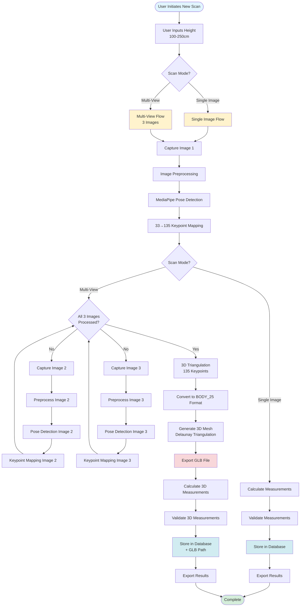

## Detailed Sub-Processes

### 1. Image Capture Process

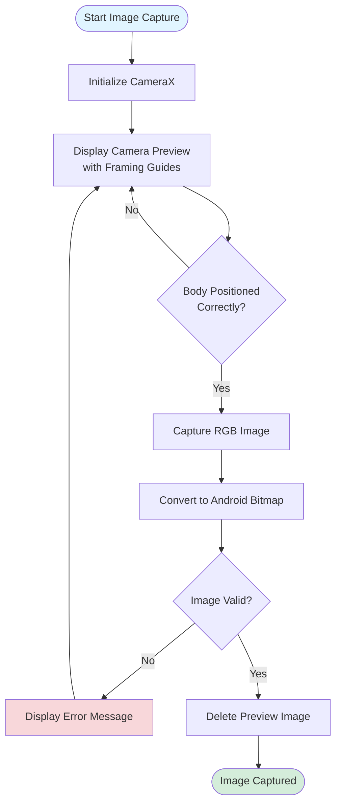

### 2. Image Preprocessing Pipeline

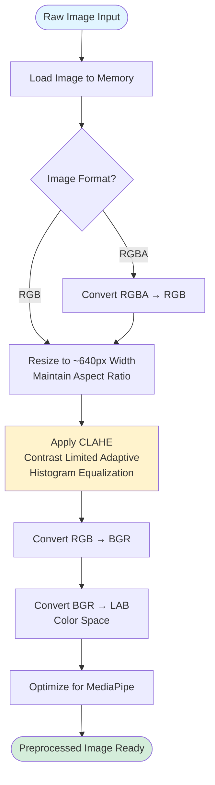

### 3. MediaPipe Pose Detection

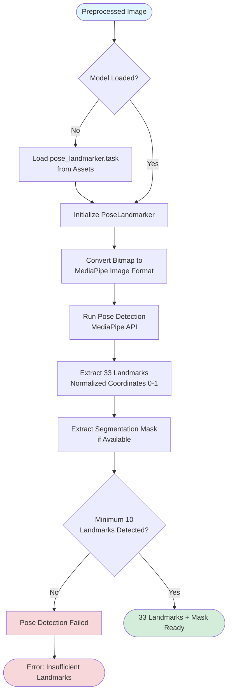

### 4. Keypoint Mapping (33 → 135)

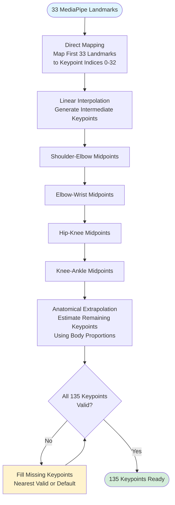

### 5. Measurement Calculation

```mermaid
flowchart TD
    StartMeasure([135 Keypoints Ready]) --> GetHeight[Get User Height Input<br/>Calibration Factor]
    GetHeight --> CalcBodyHeight[Calculate Body Height<br/>in Pixels<br/>Head-to-Feet Distance]
    CalcBodyHeight --> CalcScale[Calculate Scale Factor<br/>cm/pixel = User Height /<br/>Pixel Height]
    CalcScale --> CalcShoulder[Calculate Shoulder Width<br/>Distance: Left-Right Shoulder]
    CalcShoulder --> CalcArm[Calculate Arm Length<br/>Average: Left + Right<br/>Shoulder-Elbow-Wrist]
    CalcArm --> CalcLeg[Calculate Leg Length<br/>Average: Left + Right<br/>Hip-Knee-Ankle]
    CalcLeg --> CalcHip[Calculate Hip Width<br/>Distance: Left-Right Hip]
    CalcHip --> CalcUpperBody[Calculate Upper Body Length<br/>Vertical: Hip Midpoint to Head]
    CalcUpperBody --> CalcLowerBody[Calculate Lower Body Length<br/>Vertical: Hip Midpoint to Ankle]
    CalcLowerBody --> CalcNeck[Calculate Neck Width<br/>Horizontal: Eye Landmarks]
    CalcNeck --> CalcThigh[Calculate Thigh Width<br/>Segmentation Mask or<br/>Depth Approximation]
    CalcThigh --> ApplyScale[Apply Scale Factor<br/>to All Measurements]
    ApplyScale --> ValidateRange{Measurements in<br/>Physiological Range?}
    ValidateRange -->|No| FlagInvalid[Flag Invalid Measurements<br/>Set to Zero]
    FlagInvalid --> StoreMeasure[Store 8 Measurements]
    ValidateRange -->|Yes| StoreMeasure
    StoreMeasure --> EndMeasure([Measurements Ready])
    
    style StartMeasure fill:#e1f5ff
    style EndMeasure fill:#d4edda
    style FlagInvalid fill:#fff3cd
```

### 6. Multi-View 3D Triangulation

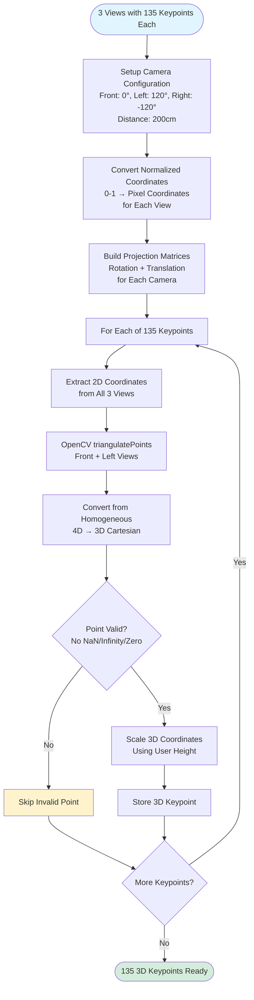

### 7. 3D Mesh Generation

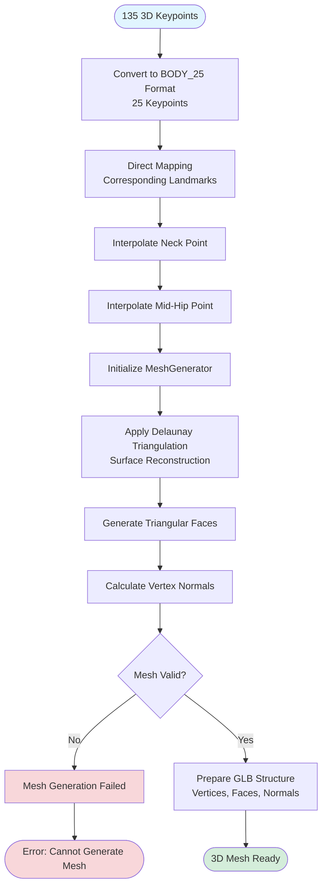

### 8. GLB Export Process

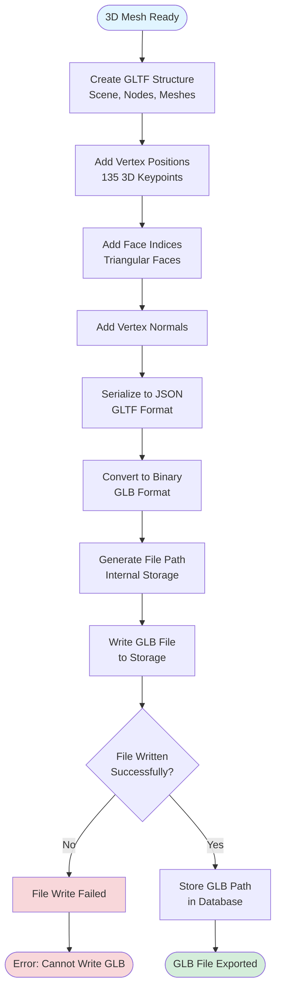

### 9. Data Storage Process

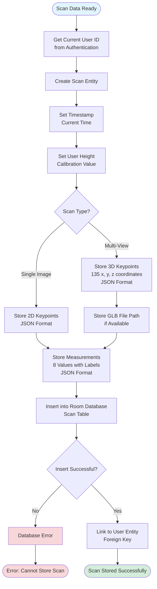

## Complete Process Timeline

### Single Image Scan Timeline

```
┌─────────────────────────────────────────────────────────────────┐
│                    SINGLE IMAGE SCAN PROCESS                    │
├─────────────────────────────────────────────────────────────────┤
│                                                                 │
│  [0ms]     User Inputs Height (100-250cm)                      │
│  [100ms]   Camera Initialization                                │
│  [200ms]   Image Capture (CameraX)                              │
│  [300ms]   Image Preprocessing (OpenCV)                         │
│             ├─ RGBA → RGB Conversion                            │
│             ├─ Resize to ~640px                                │
│             ├─ CLAHE Enhancement                                │
│             └─ Color Space Optimization                         │
│  [500ms]   MediaPipe Pose Detection                             │
│             └─ Extract 33 Landmarks                            │
│  [550ms]   Keypoint Mapping (33 → 135)                         │
│             ├─ Direct Mapping                                  │
│             ├─ Linear Interpolation                             │
│             └─ Anatomical Extrapolation                        │
│  [600ms]   Measurement Calculation                             │
│             ├─ Calculate 8 Measurements                        │
│             ├─ Apply Scale Factor                               │
│             └─ Validate Ranges                                  │
│  [650ms]   Store in Database                                    │
│  [700ms]   Export Results (JSON/CSV/PDF)                      │
│                                                                 │
│  Total: ~700ms (< 1 second)                                     │
└─────────────────────────────────────────────────────────────────┘
```

### Multi-View Scan Timeline

```
┌─────────────────────────────────────────────────────────────────┐
│                    MULTI-VIEW SCAN PROCESS                      │
├─────────────────────────────────────────────────────────────────┤
│                                                                 │
│  [0ms]      User Inputs Height (100-250cm)                      │
│  [100ms]    Camera Initialization                               │
│                                                                 │
│  ┌─ IMAGE 1 ───────────────────────────────────────────────┐  │
│  │ [200ms]   Capture Image 1 (Front View)                   │  │
│  │ [300ms]   Preprocess Image 1                             │  │
│  │ [500ms]   Pose Detection Image 1                         │  │
│  │ [550ms]   Keypoint Mapping Image 1                        │  │
│  └──────────────────────────────────────────────────────────┘  │
│                                                                 │
│  ┌─ IMAGE 2 ───────────────────────────────────────────────┐  │
│  │ [600ms]   Capture Image 2 (Left Profile)                 │  │
│  │ [700ms]   Preprocess Image 2                             │  │
│  │ [900ms]   Pose Detection Image 2                         │  │
│  │ [950ms]   Keypoint Mapping Image 2                        │  │
│  └──────────────────────────────────────────────────────────┘  │
│                                                                 │
│  ┌─ IMAGE 3 ───────────────────────────────────────────────┐  │
│  │ [1000ms]  Capture Image 3 (Right Profile)                │  │
│  │ [1100ms]  Preprocess Image 3                             │  │
│  │ [1300ms]  Pose Detection Image 3                         │  │
│  │ [1350ms]  Keypoint Mapping Image 3                       │  │
│  └──────────────────────────────────────────────────────────┘  │
│                                                                 │
│  [1400ms]   3D Triangulation                                    │
│             ├─ Build Projection Matrices                       │
│             ├─ Triangulate 135 Keypoints                       │
│             └─ Scale 3D Coordinates                            │
│  [1700ms]   Convert to BODY_25 Format                          │
│  [1800ms]   Generate 3D Mesh (Delaunay)                        │
│  [2300ms]   Export GLB File                                    │
│  [2400ms]   Calculate 3D Measurements                          │
│  [2500ms]   Validate Measurements                              │
│  [2600ms]   Store in Database (+ GLB Path)                     │
│  [2700ms]   Export Results (JSON/CSV/PDF)                      │
│                                                                 │
│  Total: ~2700ms (< 3 seconds)                                   │
└─────────────────────────────────────────────────────────────────┘
```

## Error Handling Flow

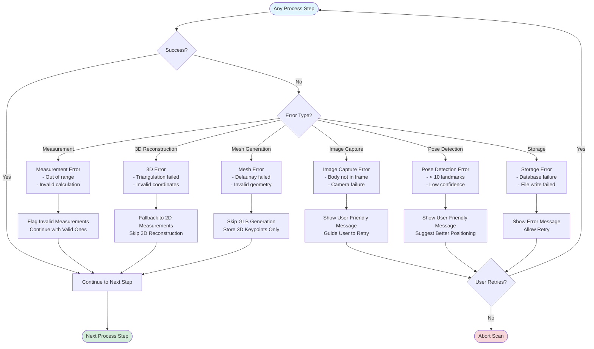

## Key Decision Points

1. **Scan Mode Selection**: User chooses between single-image quick scan or multi-view 3D reconstruction
2. **Image Validation**: System checks if body is fully visible and properly positioned
3. **Pose Detection Validation**: Minimum 10 landmarks must be detected for valid scan
4. **Measurement Validation**: All measurements checked against physiological ranges
5. **3D Reconstruction**: Only performed for multi-view scans with all 3 images successfully processed
6. **GLB Generation**: Only generated if 3D reconstruction succeeds and mesh is valid

## Performance Targets

- **Single Image Scan**: < 1.5 seconds total
- **Multi-View Scan**: < 5 seconds total
- **Memory Usage**: < 100MB peak
- **Image Processing**: < 200ms per image
- **Pose Detection**: < 500ms per image
- **3D Triangulation**: < 300ms for 135 keypoints
- **Mesh Generation**: < 500ms
- **GLB Export**: < 100ms

## Output Files

### Single Image Scan Output
- **Measurements JSON**: 8 anthropometric measurements
- **2D Keypoints JSON**: 135 normalized keypoints (x, y)
- **Export Formats**: JSON, CSV, PDF

### Multi-View Scan Output
- **Measurements JSON**: 8 anthropometric measurements (3D-enhanced)
- **3D Keypoints JSON**: 135 3D keypoints (x, y, z)
- **GLB File**: 3D mesh for visualization
- **Export Formats**: JSON, CSV, PDF

---

**Note**: All processing is performed on-device with no cloud dependencies. Images are deleted immediately after processing completion to ensure user privacy.

